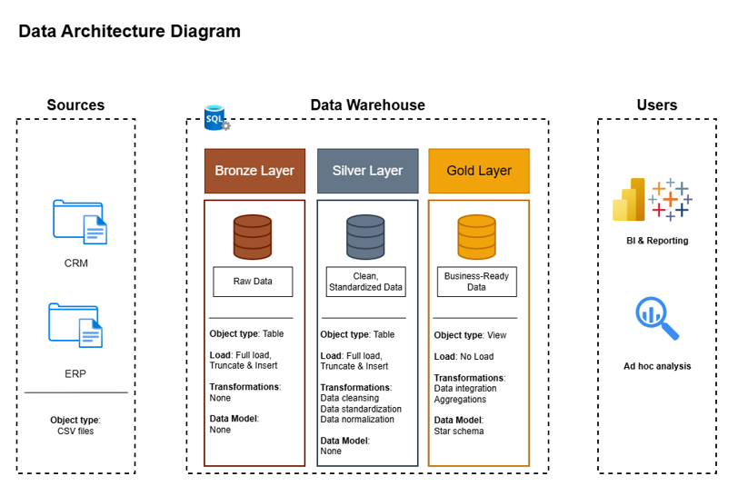

# Project Background 🛡️

The objective of this data engineering project is to demonstrate the full workflow 
from raw data ingestion to clean, business‑ready data model suitable for analytics.

### Credits & License
This project is based on a guided project created by **Baraa Khatib
Salkini (Data With Baraa)**, who licensed his original work under 
the **MIT License**, allowing reuse and sharing with attribution.
This repository represents my own implementation, structure, 
and interpretation of the project.

# Project Overview 🔎

This project includes:

1.  **Data Architecture**\
    Designing and implementing a modern warehouse using the Medallion
    framework.

2.  **ETL Pipelines**\
    Extracting, transforming, and loading data from source files into
    the warehouse.

3.  **Data Modeling**\
    Creating fact and dimension tables using star‑schema principles.

📌 *Note:*\
The analytical part (insights, business queries, dashboards) **is not
included** in this repository.\
I may create a **follow‑up project** focused on EDA, business analysis,
and reporting using the final Gold‑layer model.

# Data Architecture ⛩️

The data architecture follows the Medallion structure with **Bronze**,
**Silver**, and **Gold** layers, as in the original guided project:

1.  **Bronze Layer**\
    Stores raw data exactly as received from source systems. Data is
    ingested from CSV files into a SQL Server database.

2.  **Silver Layer**\
    Contains cleaned, standardized, and validated data prepared for
    downstream transformations.

3.  **Gold Layer**\
    Holds business‑ready analytical tables organized in a star schema
    optimized for reporting.

# Executive Summary 🔑

### Objective 
Develop a modern data warehouse using SQL Server to consolidate sales data, enabling analytical reporting and informed decision-making.

### Specifications
- **Data Sources**: Import data from two source systems (ERP and CRM) provided as CSV files.
- **Data Quality**: Cleanse and resolve data quality issues prior to analysis.
- **Integration**: Combine both sources into a single, user-friendly data model designed for analytical queries.
- **Scope**: Focus on the latest dataset only; historization of data is not required.
- **Documentation**: Provide clear documentation of the data model to support both business stakeholders and analytics teams.

Cleansing and preparation steps include:

-   Handling duplicates
-   Handling missing or inconsistent values
-   Data standardization & normalization
-   Basic validation rules

Transformations produce the final analytical schema:

-   One fact table (sales)
-   Multiple dimension tables (customers, products)

Scripts for each layer are located in the `scripts/` directory.

# DWH Data Analysis 💡

A follow‑up project focused on EDA, advanced analysis & complex reporting can be found [here](followup-analysis)
